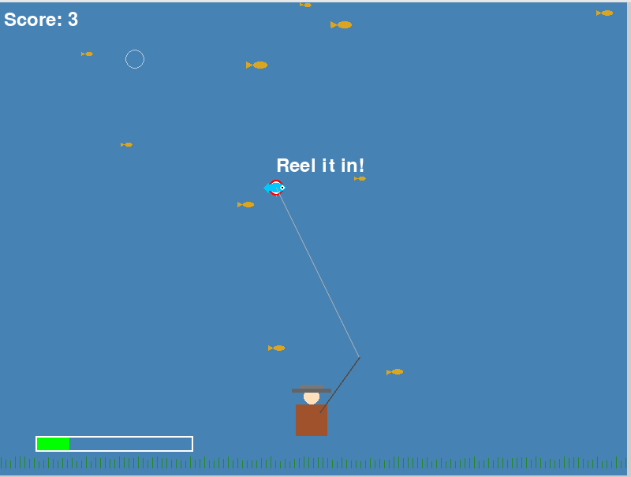

# 🎣 Backwater Bassin’

  

Welcome to *Backwater Bassin’*, a retro-inspired, fully-playable Python fishing game built for the
**Boot.dev Hackathon**!  
Cast your line, manage your tension, and hook the biggest bass in the lake while competing for the top score.
Smooth mechanics, pixel precision, and swampy vibes—this is your bass-fight arena.

---

## 📸 Screenshot



---

## 🛠️ How to Install & Play

### 🔄 Clone the Game
```bash
git clone https://github.com/tb771/backwater_bassin.git
cd backwater_bassin
python3 -m venv .venv
source .venv/bin/activate      # On Windows: .venv\Scripts\activate
pip install -r requirements.txt
python main.py

 Make sure you have Python 3.12+ and Pygame installed from the requirements!
Gameplay Instructions
Controls:

← ↑ ↓ → Arrow Keys – Move the white bullseye (crosshair) to aim your cast

Spacebar –
• Press once to cast your line at the current crosshair location
• Once a fish bites, tap spacebar repeatedly to reel it in

Watch the tension meter at the bottom of the screen!
• Keep tension between 20–80 to catch the fish
• Too high? The line breaks!
• Too low? The fish gets away!

🎯 Your Goal:
Time your casts, manage the line tension, and land as many fish as possible.

Each catch boosts your score.

Fish vary in size, behavior, and swim speed.

See if you can hit a high score before the sun sets on the bayou!

🧠 Behind the Scenes
Animated golden-orange fish with idle and tail-wagging behavior

Castable pole + visible line connecting the fisherman to your target

Tension-based reeling mechanic to simulate realistic fishing

Ambient lake effects: white water ripples, splash rings, and more

All assets written in Python using pygame

📢 Boot.dev Hackathon
This game was built for the Boot.dev Hackathon 2025 — a celebration of creative software engineering.
If you’re a judge, developer, or fellow hacker:

🐟 Try the game

🚀 Fork it, play it, remix it

🐠 Share it on social media with the hashtag:

#BootDevBassin

📂 Project Structure
bash
Copy
Edit
backwater_bassin/
├── main.py
├── fisherman.py
├── fishing_logic.py
├── fish_swarm.py
├── scoreboard.py
├── water_effects.py
├── sounds.py
├── sounds/            # Game sound effects
├── requirements.txt
├── README.md
└── screenshot.png

fry the competition
Created by
Travis Baxter
GitHub: @tb771
